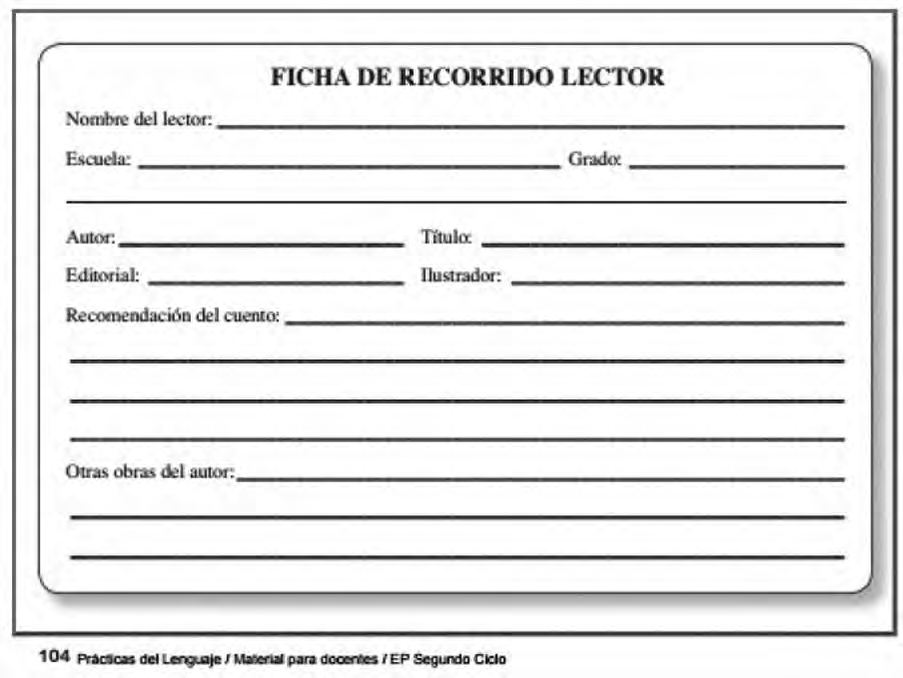

# Planificación anual

## Horario

| Horario        | Lunes          | Martes        |Miércoles      |Jueves         | Viernes       |
| ------------   |-----------     |-----          |-------        |------         |-----------    |
| 1              | P. del Lenguaje| Matemáticas   |C. Sociales    |P. del Lenguaje|P. del lenguaje|
| 2              | Plástica       | Matemáticas   |C. Sociales    |P. del Lenguaje|P. del Lenguaje|
| 3              | Educ. Fisica   |C. Naturales   |Inglés         | Asamblea      |Educ. Física   |
| 4              | Inglés         |C. Naturales   |Inglés         | Música        |C. Sociales    |
| 5              | Matemáticas    |P. del Lenguaje|P. del Lenguaje|Matemáticas    |C. Naturales   |
| 6              | Matemáticas    |P. del Lenguaje|Matemáticas    |Matemáticas    |Matemáticas    |

**Distribución horaria**

- 23 módulos de 40'
- 8 módulos de Matemática. 3 módulos de 80' y 2 módulos de 40'.
- 8 módulos de Prácticas del lenguaje. 3 módulos de 80' y 2 módulos de 40'.
- 3 de Ciencias Naturales. 1 módulo de 80' y 1 módulo de 40'.
- 3 de Ciencias Sociales. 1 módulo de 80' y 1 módulo de 40'.
- 1 de Asamblea de grado 1 módulo de 40'.

## Prácticas del lenguaje
>Para formar practicantes de la lectura y la escritura, es necesario hacer de la escuela una comunidad de lectores y escritores. Una comunidad de lectores que acuden a los textos buscando respuesta para los problemas que necesitan resolver, tratando de encontrar información para comprender mejor algún aspecto del mundo que es objeto de sus preocupaciones, buscando argumentos para defender una posición con la que están comprometidos o para rebatir otra que consideran peligrosa o injusta, deseando conocer otros modos de vida, identificarse con otros autores y personajes o diferenciarse de ellos, correr otras aventuras, enterarse de otras historias, descubrir otras formas de utilizar el lenguaje para crear nuevos sentidos...
Una comunidad de escritores que producen sus propios textos para dar a conocer sus ideas, para informar sobre hechos que los destinatarios necesitan o deben conocer, para incitar a sus lectores a emprender acciones que consideran valiosas, para convencerlos de la validez de los puntos de vista o de las propuestas que intentan promover, para protestar o reclamar, para compartir con los demás una bella frase o un buen escrito, para intrigar o hacer reír...
Hacer de la escuela un ámbito donde lectura y escritura sean prácticas vivas y vitales, donde leer y escribir sean instrumentos poderosos que permitan repensar el mundo y reorganizar el propio pensamiento, donde interpretar y producir textos sean derechos que es legítimo ejercer y responsabilidades que es necesario asumir.

>Diseño Curricular Tomo 2 G.C.A.B.A

<table>
<tr>
<th colspan="7" align="center"> Primer Cuatrimestre 2017</td>
</th>
<tr>
  <th rowspan="7"> Modalidades Organizativas</th>
  <th rowspan="4" valign="bottom">Situaciones habituales</th>
  <th>Marzo</th>
  <th>Abril</th>
  <th>Mayo</th>
  <th>Junio</th>
  <th>Julio</th>
</tr>
<tr>

  <td rowspan="3" colspan="5">Portfolio de producciones del año   Biblioteca del aula   Asamblea de grado  Biblioteca institucional</td>

</tr>
<tr>
</tr>
<tr>
</tr>
<tr>
  <th rowspan="3"> Secuencias y Proyectos</th>
  <td colspan="2">Antología de cuentos</td>
    <td></td>
    <td colspan="2">Lectura de novela por episodios</td>

</tr>
  <td border="0"></td>
  <td colspan="2">Leer y escribir para estudiar</td>
  <td colspan="2"></td>

<tr>
  <td colspan="2"></td>

  <td colspan="3">Leer en medios digitales</td>
</tr>
</table>

<table>
<tr>
<th colspan="7" align="center"> Segundo Cuatrimestre 2017</td>
</th>
<tr>
  <th rowspan="7"> Modalidades Organizativas</th>
  <th rowspan="4" valign="bottom">Situaciones habituales</th>
  <th>Agosto</th>
  <th>Septiembre</th>
  <th>Octubre</th>
  <th>Noviembre</th>
  <th>Diciembre</th>
</tr>
<tr>

  <td rowspan="3" colspan="5">Portfolio de producciones del año   Biblioteca del aula   Asamblea de grado   Biblioteca institucional</td>

</tr>
<tr>
</tr>
<tr>
</tr>
<tr>
  <th rowspan="3"> Secuencias y Proyectos</th>
  <td colspan="3">Seguir un autor</td>
    <td></td>
  <td></td>
</tr>
  <td border="0"></td>
  <td colspan="2">Leer y escribir para estudiar</td>
  <td colspan="2"></td>

<tr>
  <td colspan="2"></td>

  <td colspan="3">Leer en medios digitales</td>
</tr>
</table>

### Relevamiento de punto de partida

1. Completar una ficha con información de cuentos que hayan leído el año anterior
  
2. Secuencia "La bruja de abril" de Ray Bradbury en el marco del proyecto [Antología de cuentos](antologiaDeCuentos.md)

### Situaciones habituales

- [Portfolio de producciones](portfolio.md)
- [Biblioteca del aula](bibliotecaDelaula.md)

### Secuencias y proyectos

- [Antología de cuentos](antologiaDeCuentos.md)
- [Leer y escribir para estudiar](leerYEscribirParaEstudiar.md)
- [Leer en medios digitales](LeerEnMediosDigitales.md)

### Situaciones de reflexión sobre el lenguaje

### Situaciones para valorar y reflexionar sobre los procesos

## Matemáticas
Seleccioné este recorte teniendo en cuenta que “la enseñanza de la multiplicación y de la división demanda varios años de trabajo en la escolaridad para que los alumnos puedan identificar los diferentes problemas que esas herramientas permiten resolver, logren dominar la variedad de relaciones numéricas que es posible establecer y elaboren la diversidad de recursos de cálculo que es pertinente disponera propósito de estas operaciones."[1]

## Ciencias Sociales

## Ciencias Naturales

## Formación ética y ciudadana

[1] Itzcovich, H.,(2007) La Matemática escolar: las prácticas de enseñanza en el aula. Buenos Aires, Aique.
